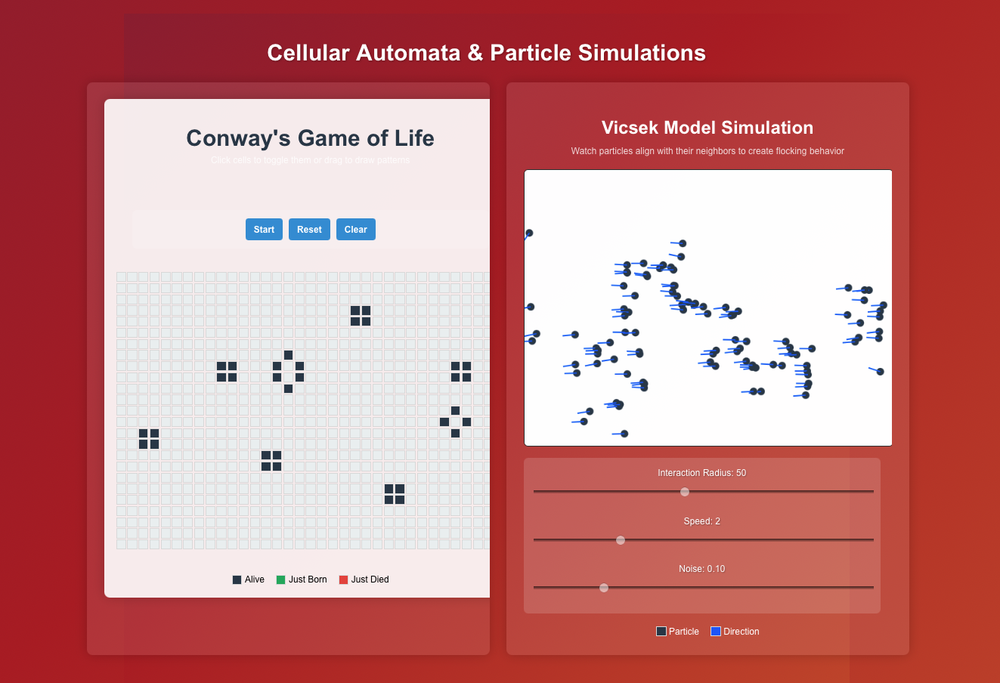

# Cellular Automata & Particle Simulations

This project demonstrates two simulations:

## Conway's Game of Life

An implementation of the classic cellular automaton devised by mathematician John Conway. The simulation follows simple rules:

- Any live cell with 2-3 live neighbors survives
- Any dead cell with exactly 3 live neighbors becomes alive
- All other cells die or stay dead

Features:
- Interactive grid where you can toggle cells by clicking
- Click and drag to "draw" patterns
- Start/Stop/Reset controls
- Visual indicators for newly born and dying cells
- Grid stabilization detection

## Vicsek Model

A particle-based simulation that demonstrates emergent flocking behavior, similar to bird flocks or fish schools. The model shows how local alignment rules can lead to global order.

Features:
- Adjustable interaction radius between particles
- Speed control
- Noise parameter to simulate real-world imperfections
- Periodic boundary conditions
- Visual representation of particle positions and directions

## Technologies Used

- React with TypeScript
- HTML5 Canvas for particle simulation
- CSS for styling and animations

## Getting Started

1. Clone the repository
2. Install dependencies with `npm install`
3. Run the development server with `npm start`
4. Visit `localhost:3000` in your browser
